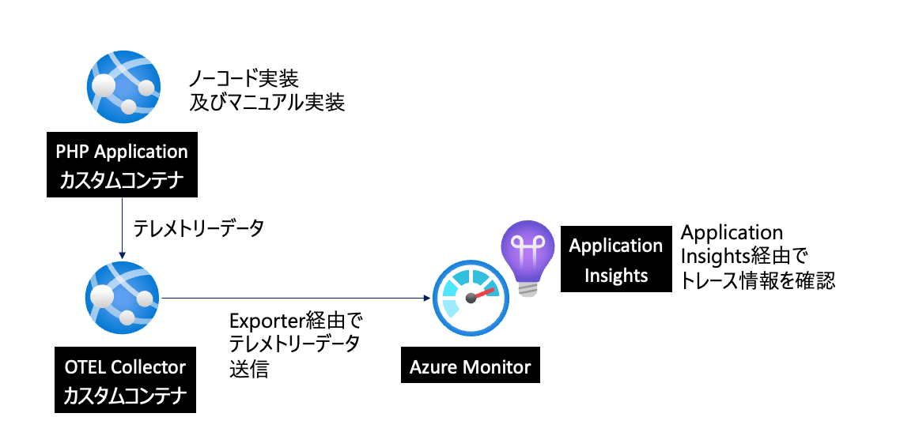

# 概要

Opentelemetryを使ってLaravelの可観測性を上げるサンプルプロジェクトです。
azdを使ってインフラ構築、デプロイ(今後)を行います。

## 構成



App Serviceのカスタムコンテナを複数、もしくはサイドカーでOpenTelemetry Collectorを立ち上げ、そこからAzure Monitorにデータを送信します。

送られたデータはApplication Insightsに格納され、可観測性を上げることができます。

## 前提条件

- Dockerがインストールされていること。
(Docker Desktopを推奨します。)

- azdがインストールされていること。
  - azd auth loginを実行してログインしてください。

## 依存パッケージ

```php
composer require open-telemetry/sdk
composer require open-telemetry/exporter-otlp
composer require guzzlehttp/guzzle
composer require php-http/guzzle7-adapter
composer require open-telemetry/opentelemetry-auto-laravel

# for distributed tracing 
composer require open-telemetry/opentelemetry-auto-psr15
composer require open-telemetry/opentelemetry-auto-psr18
composer require open-telemetry/opentelemetry-auto-guzzle
```

### Optional

オプションとして、Laravelがロギングに使用しているパッケージであるmonologに計装を作成することで、各トレースにログを添付することができます。この方法を使う利点は、OpenTelemetry SDKに、トレースへのログの自動相関をさせることです。

```php
composer require \
  monolog/monolog \
  open-telemetry/opentelemetry-logger-monolog
```

grpc

```php
composer require grpc/grpc@1.57.0
composer require open-telemetry/transport-grpc
```

もしgrpcがインストールされていない場合環境変数を`OTEL_EXPORTER_OTLP_PROTOCOLを"grpc"から"http/json"`に変更する必要があります。

下記画像はdocker-composeを使った環境変数の例です。


### 設定とApplication Insightsアウトプットについて

[設定と詳細](./docs/detailed.md)をご覧ください。

## インフラの構築

```bash
azd provision
```

このコマンドでインフラが構築されます。

## ローカルでの実行

.env.exampleをコピーして.envを作成します。

```bash
cp .env.example .env
```

.env内の
`APPLICATIONINSIGHTS_CONNECTION_STRING`の値を作成したApplicationInsightsの接続文字列に変えます。

```.env
APPLICATIONINSIGHTS_CONNECTION_STRING="InstrumentationKey=xxxxx..."
```

```bash
docker compose up -d --build --force-recreate
```

こちらでコンテナが立ち上がります。
またmakeコマンドが使えれば下記のコマンドでコンテナを立ち上げることができます。

```bash
make up
```

リソースを消す場合は下記のコマンドを実行してください。

```bash
docker compose down
```

makeコマンドが使えれば下記のコマンドでコンテナを消すことができます。

```bash
make down
```

## デプロイ

本レポを使ってデプロイすることも可能です。
改良の余地ありですが、下記の手順で実行可能です。

### 事前準備

`src/opentelemetry/Dockerfile`を編集して、`APPLICATIONINSIGHTS_CONNECTION_STRING`の`your-connection_string_here'の値を作成したApplicationInsightsの接続文字列に変えます。


### イメージのビルドとプッシュ

環境構築の際に使った`azd provision`コマンド、もしくはビルドスクリプトを実行します。

Linux or Mac

```bash
./scripts/azAcrBuild.sh
```

Windows

```powershell
./scripts/azAcrBuild.ps1
```

このコマンドを行うことで、`azd provision`で作成したAzure Container RegistryにDockerイメージがpushされます。

なお、`azd provision`を実行した際にazdの設定が書かれたazure.yamlファイルの働きにより、リソースプロビジョン後に自動でビルドスクリプトも実行されます。

もし上記の事前準備を行なっている場合は再度ビルドスクリプトを実行する必要はありません。

なお、本来Otel Collectorでは${env:APPLICATIONINSIGHTS_CONNECTION_STRING}のように記載することでコンテナ内の環境変数を使って各種リソースの接続の設定を行うことができます。

そのため、本来は事前準備必要なくApp Serviceの環境変数の変数の設定だけでApplication Insightsの接続文字列を指定することができるはずです。

ただ、ここはApp Serviceカスタムコンテナの仕様上、環境変数を使うためにApp Service基盤上のコンテナからOpen Telemetry Collectorのコンテナに環境変数を渡す必要があります。

この問題はシェルなどのスクリプトを使うことで解決できますが、残念ながらOtel Collectorのコンテナはバイナリベースで実行されているためShellなどのスクリプトを実行することができません。

そのため、代替手段として上記の手段を取ります。
将来的にはDockerfile自体の書き換えを検討します。
(通常のLinuxコンテナにOtel Collectorをマニュアルインストールしたコンテナを別途作成することを想定)

### App Serviceの作成とデプロイ

ここではAzureポータルを使ってリソース作成する方法を紹介します。

設定においてポイントは二つです。

1. 基本タブの`公開`の設定をコンテナーにすること


2. コンテナタブで`サイドカー`を有効にすることです。


なおコンテナタブの設定項目は下記のように記載しますが、
後で設定可能ですので間違っていても問題ありません。

`サイドカーのサポート:` 有効にする。
`イメージソース:` Azure Container Registry
名前: 任意の名前。mainやlaravelなど  
``レジストリ:` Azure Container Registryの名前
`azd provision`でリソースを作成した場合は`acr${ユニークトークン}`という命名規則で自動作成されます。  
`タグ:` latest(もしくはあなたがビルドしたコンテナのタグ)  
`Authentication:` Managed IdentityとAdmin credentialどちらも使うことができます。
ただし、Admin credentialを使う場合は、Azure Container Registryの設定で管理者ユーザーを有効にする必要があります。  
`Identity:` Managed Identityを選択の際に選択、もしくは作成する。  
今回のセットアップでazd provisionを実行した場合は、Managed Identityを使うことができます。  
命名規則は`id-rg-環境名`でACR Pullの権限が付与されています。
`イメージ:` `laravel`(もしくはあなたがビルドしたコンテナの名前)
`ポート:` `80`  

なお、Managed Identityを選択した場合自動でコンテナイメージの一覧が取れないので、スペルミスなどがないか注意する必要があります。

サイドカーであるOtel Collectorの設定は後で行います。

### App Serviceの環境変数の設定とサイドカーの設定

App Serviceのリソース作成が完了したら、App Serviceの環境変数を設定します。

下記は設定例です。


特に注意したいところは  
`OTEL_EXPORTER_OTLP_ENDPOINT`の値です。
App Serviceではデフォルトでgrpcが使えないため、http/jsonのエンドポイントを指定する必要があります。

`http://localhost:4317`の場合下記のようなエラーメッセージがLaravelに出力されます。

こちらはgrpcに対応していないサーバーにgrpcでリクエストを投げた場合のエラーメッセージです。

こちらの対応方法についても別途検討します。

```bash
2025-02-27T14:44:53.4841491Z NOTICE: PHP message: OpenTelemetry: [error] Export failure [exception] cURL error 1: Received HTTP/0.9 when not allowed (see https://curl.haxx.se/libcurl/c/libcurl-errors.html) for http://localhost:4317/v1/traces [previous] 
```

最後にOtel Collectorのデプロイを行います。


App Serviceのデプロイセンターからサイドカーとしてotel-collectorをデプロイします。

`イメージソース:` Azure Container Registry  
`レジストリ:` Azure Container Registryの名前
`azd provision`でリソースを作成した場合は`acr${ユニークトークン}`という命名規則で自動作成されます。  
`イメージ:` `otel-collector`(もしくはあなたがビルドしたコンテナの名前)  
`ポート:` `4318`
Laravel側の`OTEL_EXPORTER_OTLP_ENDPOINT`の値と合わせる必要があります。

その上でApp Serviceの概要からURLを開くと
Laravelのアクセスに合わせてApplication Insightsにデータが送信されていることが確認できます。


## デプロイのトラブルシューティング

主なハマりどころは下記です。

- イメージがPullできない、失敗している。
イメージのプルができない場合は、イメージの名前やタグが間違っている可能性があります。

そのため、Azure Container Registryのイメージの一覧を確認して一致させて下さい。

また、更新がされないようでしたらApp Service概要から再起動を行ってください。

再起動を行うとコンテナイメージのPullから再実行が行われます。

- Otel Collectorが起動しない。
`APPLICATIONINSIGHTS_CONNECTION_STRING`の値が設定されていない、もしくは間違っているとnullではダメだとエラーメッセージを吐いて落ちてしまいます。

上述の通りDockerfile`your-connection_string_here`の値を確認してからビルドしてください。

デバック方法としてはデプロイセンターからステータスをチェックしクリックしてログを確認することをお勧めします。


- Laravelの起動が失敗する
Laravel単体であれば正常に起動しますが、Otel Collectorをサイドカーで立ち上げると起動しない場合があります。

それはOpenTelemetryのExporterが正常に送れないためプロセスが落ちてしまうからです。

前述のように`OTEL_EXPORTER_OTLP_ENDPOINT`の値を確認してください。デプロイセンターからログを見ると、Otel Collectorに接続ができていなくてプロセスが死んでいるという現象が見られたりします。

## 参照

[How To Use OpenTelemetry in Laravel 11](https://www.gmhafiz.com/blog/laravel-with-opentelemetry/)

[Laravel 11 with OpenTelemetry ソースコード例](https://codeberg.org/gmhafiz/observability/src/branch/master/laravel)