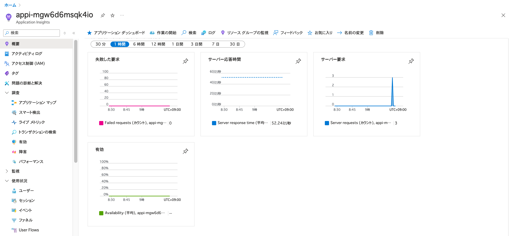
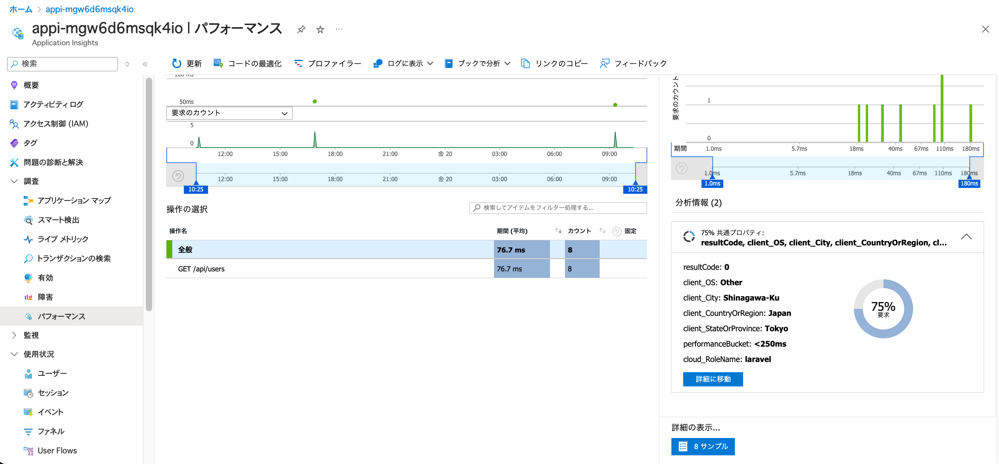

# 概要

OpenTelemetryでは自動計装と手動計装の両方が可能です。

自動計装は楽ですが、ある程度できることが限られています。
このドキュメントでは"どこまで計装すればどこまでできるのか"を説明します。

## OpenTelemetryの計装

OpenTelemetryで取得可能なテレメトリーデータは主に3種類です。

- トレース: リクエストの流れを追跡する
- メトリクス: リクエストの成功率やレイテンシーを計測する
- ログ: リクエストの詳細を記録する

計装のスタートはトレースです。
トレースを取得することで、リクエストの流れを追跡することができます。

またトレースに付随させる形でメトリクスやログを取得することもできます。

そうすることでリクエストのボトルネックを把握しつつ、リクエストの詳細を把握することができます。

## Laravel＋Azureでの計装

Laravel＋Azureでの計装はApplication Insightsを使うことで可能です。

PromethusやJaegerなどのツールを使うこともできますが、複雑な構成になります。

Application Insightsを使うことでAzureネイティブで計装データを確認できるため利用しやすいです。

Application Insightsではトレース、メトリクス、ログを取得することができます。

### Laravel + Azure Application Insightsのアーキテクチャ概要

Laravel + Azure Application Insightsのアーキテクチャは下記の通りです。


PHPのアプリケーションから直接Azure Monnitorにデータを送信することはできません。

したがってOpenTelemetry Collector経由でAzure Monitorにデータを送信します。

その際App Serviceの場合GAとなったサイドカーを使って複数コンテナを使用してPHPのコンテナからOpenTelemetry Collectorにデータを送信できます。

OpenTelemetry CollectorはExpoterを使ってAzure Monitorにデータを送信します。

そうすることでAzure Monitorにデータを送信することができます。

Azure Montior Exporterについて詳細は下記をご覧ください。

OpenTelemetryで取得したさまざまなテレメトリーデータはAzure Monitorのテーブルに併せて変換され送信されます。

[Azure Monitor Exporter](https://github.com/open-telemetry/opentelemetry-collector-contrib/blob/main/exporter/azuremonitorexporter/README.md)

## 計装の種類

計装には大きく分けて2種類あります。

- 自動計装
- 手動計装

オブザーバービリティの観点からは、手動計装を使ってテレメトリーを拡充していくことが望ましいですが、手動計装は手間がかかります。

そのため、まずは自動計装を使ってテレメトリーを取得し、手動計装を追加していくことを推奨します。

## 自動計装

Laravelでは自動計装を行うことができます。

**open-telemetry/opentelemetry-auto-laravel**をインストールすることで、自動計装を行うことができます。

```php
composer require open-telemetry/opentelemetry-auto-laravel
```

Laravelの自動計装でApplication Insightsに送った場合の出力について下記に記録しておきます。

### 概要ページ



まず概要欄でサーバー要求の数や応答時間、エラー数などが確認できます。

このデータはAzure MonitorでのAppRequestテーブルに格納されています。


例外についてもAppExceptionテーブルに格納されています。


### アプリケーションマップ

アプリケーションマップでは依存関係が可視化されます。

依存関係となるデータベースアクセス速度やそのSQLクエリの実行時間などが確認できます。


このデータはAzure MonitorでのAppDependenciesテーブルに格納されています。


### パフォーマンス


パフォーマンスではリクエストのレイテンシーや依存関係のレイテンシーが確認できます。

またトレースの詳細も確認できます。

ルートごとのレイテンシーや依存関係のレイテンシーが確認できます。

ルートについてクリックするとトレースの詳細が確認できます。

75%　共通プロパティの値についてはある特定のプロパティを持つ属性のアクセスの75%がperformanceBacketに含まれることを示します。

例えば < 250msの場合、75%のリクエストが250ms未満で完了していることを示します。


サンプルをクリックするとサンプルの一覧が取得できます。


サンプルをクリックするとトレースの詳細が確認できます。


トレースではルートとデータベースアクセスがある場合接続先とそのレーテンシーが確認できます。

## 手動計装

TBD
